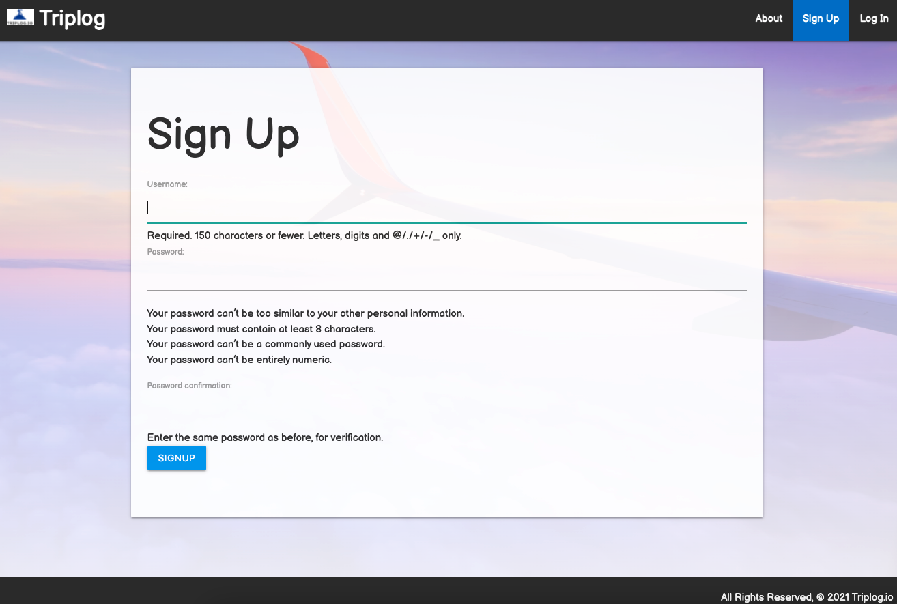

# Triplog.io
Welcome to Triplog.io
Triplog is an experimental application created to be able to log our trips efficiently in an organized fashion. You will also be able to share our experiences with other users. This application consist of a backend using Django, Postgresql, Python and a frontend using HTML, CSS, Javascript and Materialize CSS.

## Application Features:
1. User is able to register an account and sign in.
2. On the homepage there is a location carousel displaying travel images.
3. Implement authorization by restricting access to the app's features depending on if the user is logged in or not.
4. Each user has their own page displaying their own trips.
5. User is able to Create, Read, Update, and Delete (CRUD) trips.
6. User is able to upload photos of their trip.
7. User is able to comment on their own trip and reply to other people who comment.
8. Trips can be set to public meaning other users in the application can check out their images, plans, and comment on their trips.
9. Trips are filtered between upcoming trips and past trips depending on if the trip date has already passed today's date.
10. We have a search functionality in the navbar where users can search by trip location name (ex: Germany, Italy etc.)
11. Mobile Friendly and responsive design.

## Technologies used
- Python
- Django
- PostgreSQL
- HTML5
- CSS / Materialize CSS
- JavaScript
- Heroku

## Screenshots

- Home Page 
  
- Signup Page 
  
- View Upcoming Trips 
  
- Trip Detail 
  

## Getting Started

[Click here](https://triplogapp.herokuapp.com/) to see the deployed Project.

## Future Enhancements

- Add functionality to check a destination's weather from within the app.

## Developer Team

[Daniel Werminghausen](https://danielwerminghausenporfolio.netlify.app/) 
Daniel Hill 
Steve Braaksma 
Mario Recinos 
