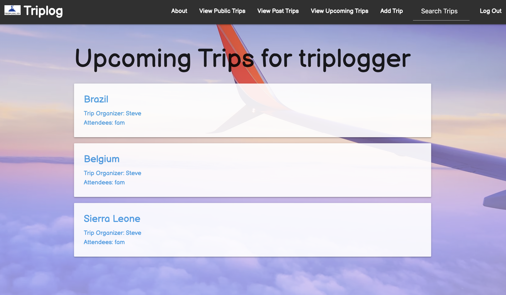

# [Triplog.io](https://triplogapp.herokuapp.com/)
Welcome to Triplog. This is an experimental application created to be able to log our trips efficiently in an organized fashion. You will also be able to share your experiences with other users. This application consist of a backend using Django, Postgresql, Python and a frontend using HTML, CSS, Javascript and Materialize CSS.

## Application Features:
1. As a user you are able to register an account and sign in.
2. On the homepage there is a image carousel displaying travel images.
3. Authorization restricts access to the app's features. Each user is given a secure experience by authenticating the user to their own individual trip pages by restricting acces to certain features that belong to the user.
4. Each user has their own page displaying their own trips.
5. A user is able to Create, Read, Update, and Delete (CRUD) trips.
6. A user is able to upload photos of their trip.
7. A user is able to comment on their own trip and reply to other people who comment.
8. Trips can be set to public meaning other users in the application can check out their images, plans, and comment on their trips.
9. Trips are filtered between upcoming trips and past trips depending automatically based on the trip date.
10. A logged in user has access to a search functionality in the navbar where users can search by trip location name (ex: Germany, Italy etc.)
11. The application is mobile friendly with responsive design.

## Technologies used
- Python
- Django
- PostgreSQL
- AWS
- HTML5
- CSS / Materialize CSS
- JavaScript
- Heroku

## Screenshots

- Home Page 
  
- Signup Page 
  
- View Upcoming Trips 
  
- Trip Detail 
  

## Pitch Deck

[Click here](https://docs.google.com/presentation/d/1bWYWVYajNoHXlFWXz6AX0giLQI4TCZtlB8GrG6gjIDA/edit#slide=id.p/) to see the Pitch Deck.

## Trello Board

[Click here](https://trello.com/b/5F9zikrK/traveler-app/) to see the Trello Board.

## Future Enhancements

- Add functionality to check a destination's weather from within the app.

## Developer Team

[Daniel Werminghausen](https://danielwerminghausenporfolio.netlify.app/) 
Daniel Hill 
Steve Braaksma 
Mario Recinos 
